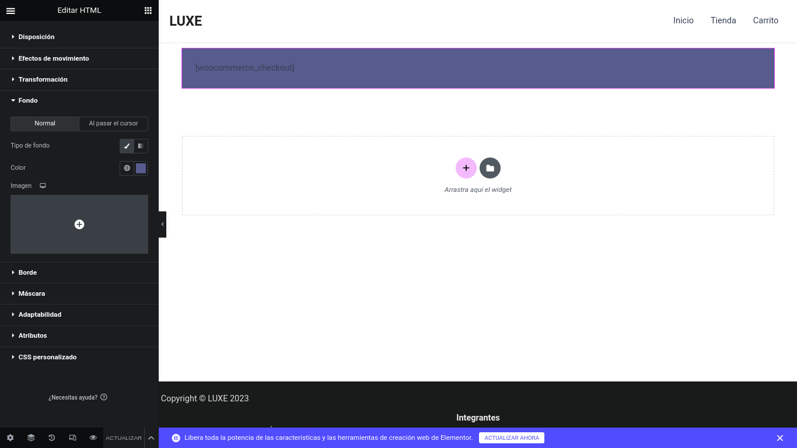
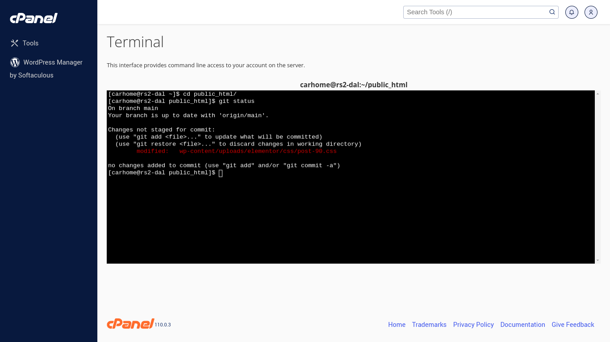
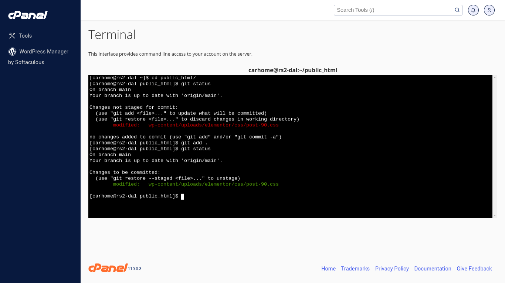
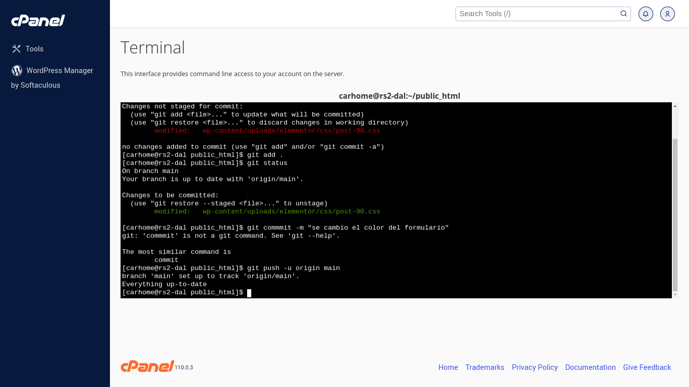
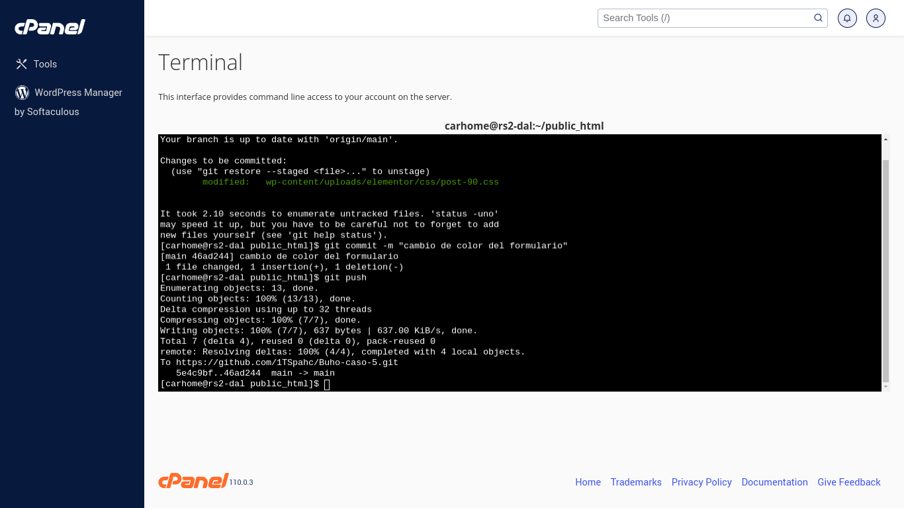
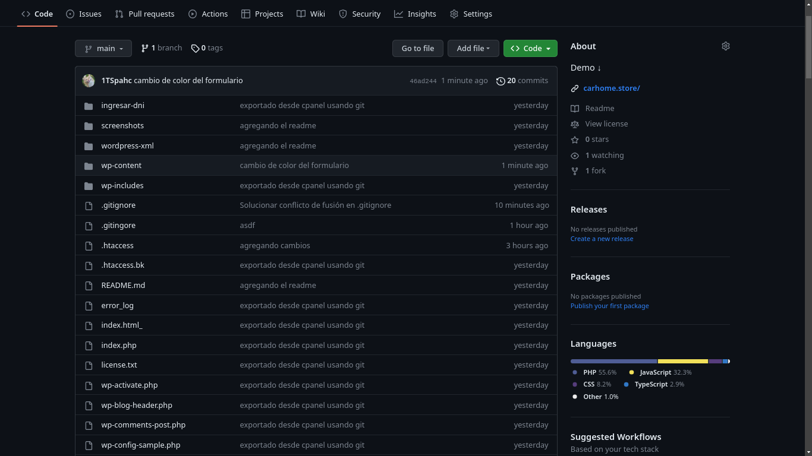

# **Migracion de wordpress CPANEL** 

### 1: Primero realizamos un cambio de la pagina usando elementor-wordpress. ✅
⬇️


#
### 2: Ingresar a la terminal de cpanel y usar un comando de git ( ```git status``` ) para ver que cambios se realizo en la pagina. ✅
⬇️


#
### 3: Añadimos ese cambio a git usando (```git add .```) para añadir todos los cambios que se hicieron en wordpress ( en este caso solo 1). ✅
⬇️


#
### 4: Añadimos un mensaje para decir a todos los desarrolladores el porque del cambio utilizando este comando (```git commit -m "cambiando el color del formulario"```). ✅
⬇️


#
### 5: Por ultimo pusheamos los cambios usando el sgte comando (```git push -u origin main```) para enviar los cambios al repositorio remoto que esta en github. ✅
⬇️


#
### 6: Por ultimo revisamos si los cambio se enviaron correctamente al repositorio remoto. ✅
⬇️



