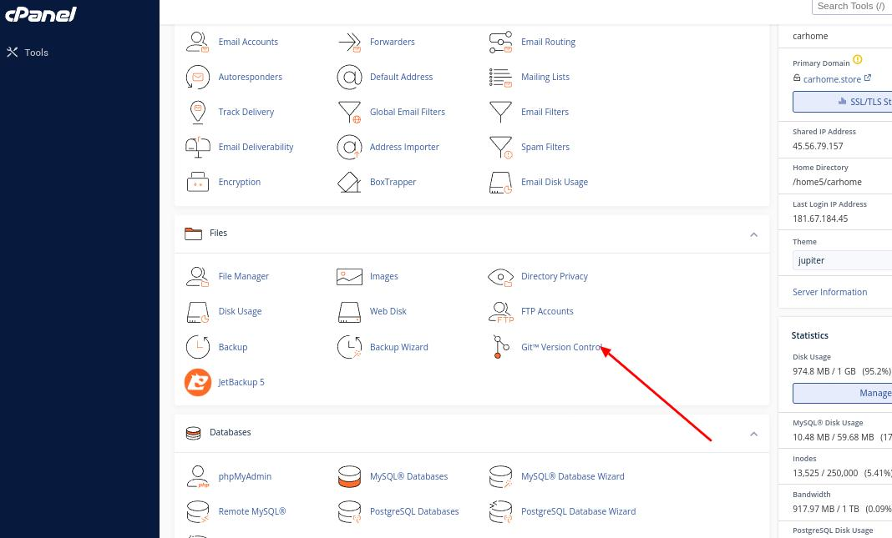
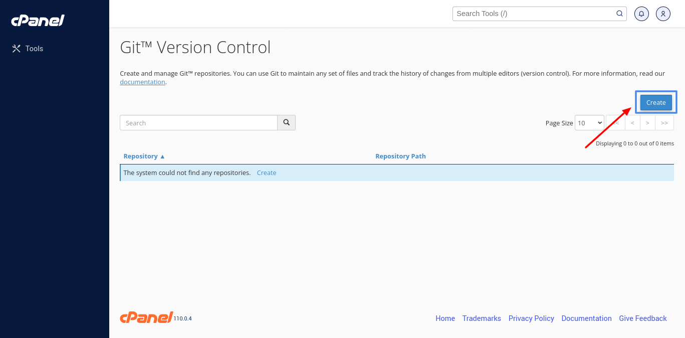
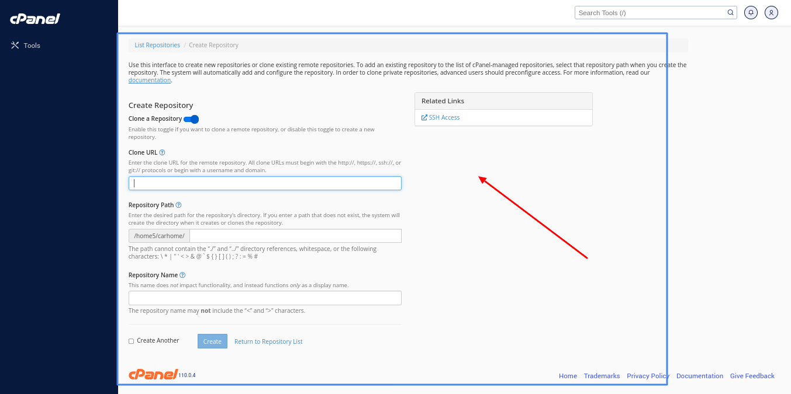
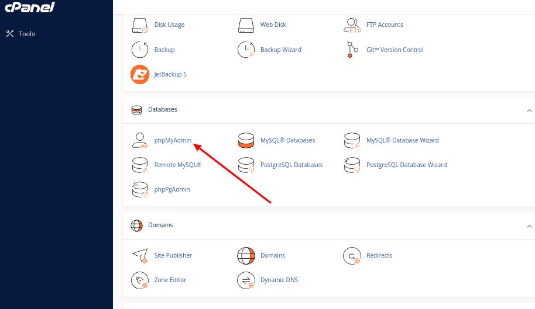
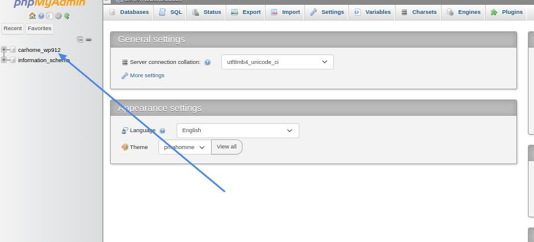
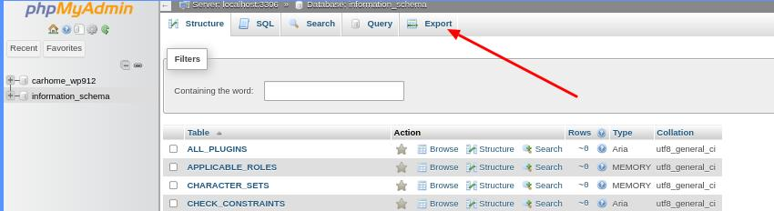
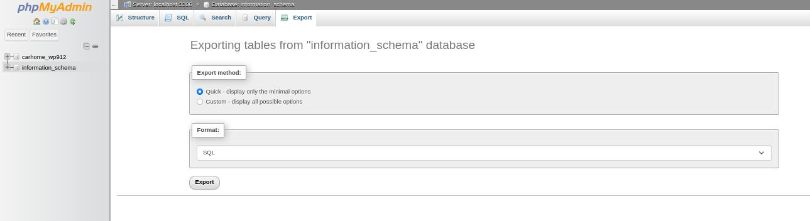

# **Migracion de wordpress CPANEL** 

### 1: Primero realizamos un cambio de la pagina usando elementor-wordpress. ✅
⬇️


#
### 2: Ingresar a la terminal de cpanel y usar un comando de git ( ```git status``` ) para ver que cambios se realizo en la pagina. ✅
⬇️


#
### 3: Añadimos ese cambio a git usando (```git add .```) para añadir todos los cambios que se hicieron en wordpress ( en este caso solo 1). ✅
⬇️


#
### 4: Añadimos un mensaje para decir a todos los desarrolladores el porque del cambio utilizando este comando (```git commit -m "cambiando el color del formulario"```). ✅
⬇️


#
### 5: Por ultimo pusheamos los cambios usando el sgte comando (```git push -u origin main```) para enviar los cambios al repositorio remoto que esta en github. ✅
⬇️


#
### 6: Por ultimo revisamos si los cambio se enviaron correctamente al repositorio remoto. ✅
⬇️


#
## Si queremos migrar de hosting. 🚀
#
#### Cada proveedor de hosting debe temer la siguiente herramienta para poder clonar repositorios de git. ⬇️



#### Con esta funcionalidad tenemos la posibilidad de clonar nuestro repositorio remoto. ⬇️



#
#### Tambien podemos exportar la base de datos de nuestro anterior provedor siguiendo estos pasos. ⬇️




#### Y con eso se nos deberia descargar un archivo con extencion sql, si queremos podemos importar esta base de datos al nuevo hosting junto a la pagina web.


